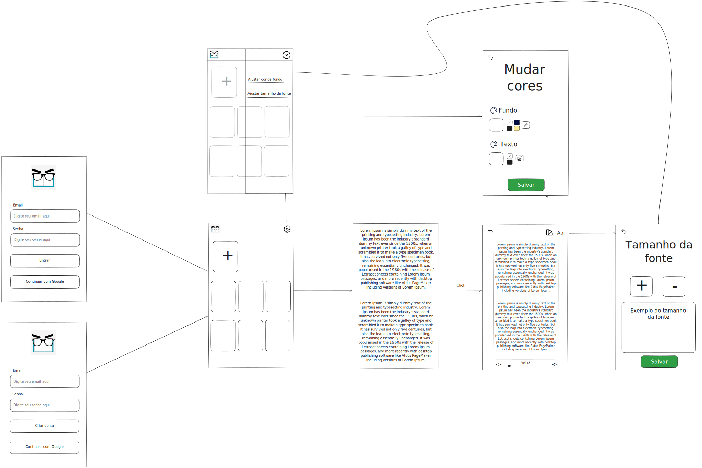

 

<h1 style="text-align: center;">Miope+</h1>

## Visão geral

O Miope+ é um aplicativo de leitura para míopes ou aqueles que estão cansados de procurar uma experiência confortável ao ler um livro em PDF.

Com o Miope+, basta fazer o upload do PDF que desejas e terás a liberdade de personalizar cor do fundo, da letra e o tamanho da fonte a fim de melhorar a leitura do usuário.

## Wireframe

## Autor

  
  <a href="https://github.com/williamdev20">William Alves</a>

## Créditos

Os ícones desse projeto foram retirados do [Flaticon](https://www.flaticon.com/) e pertencem ao autores [Freepik](https://www.flaticon.com/authors/freepik) e [See icons](https://www.flaticon.com/authors/see-icons)

## Licença

Este projeto está licenciado sob a licença [MIT](LICENSE).